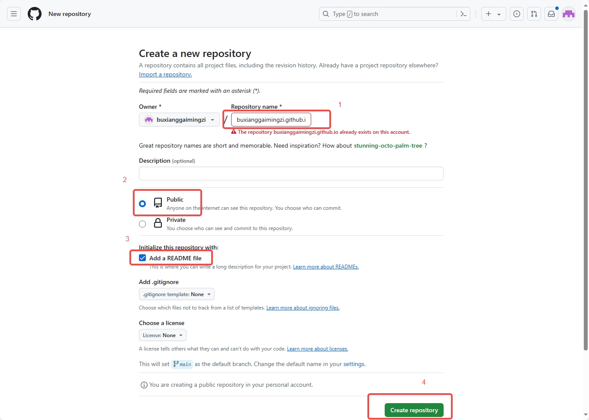
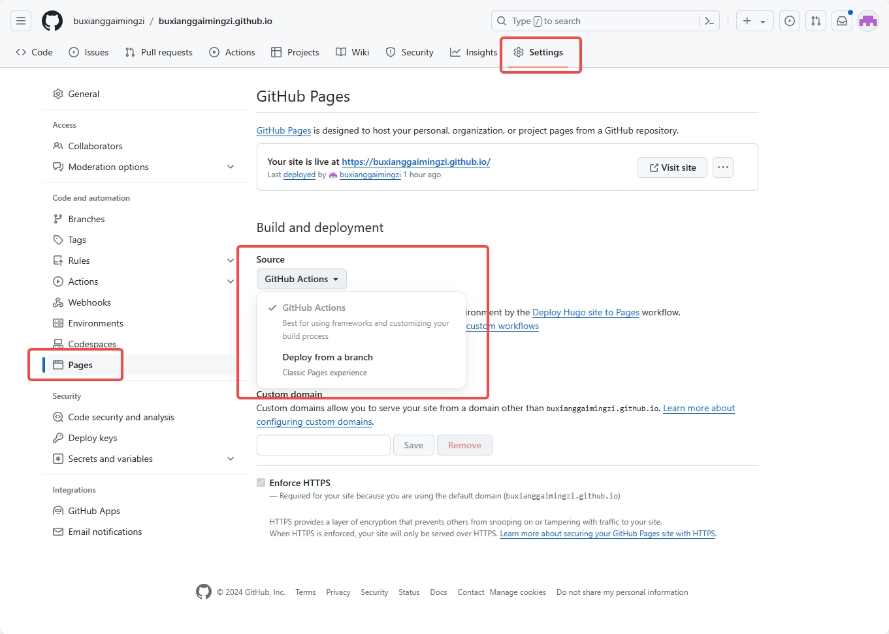
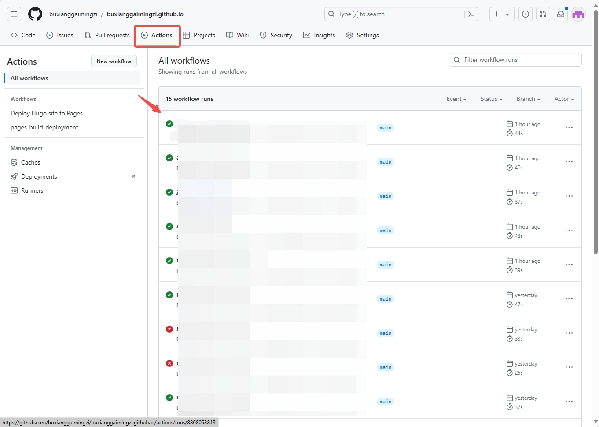

+++
title = 'Github Pages+Hugo搭建个人博客'
date = 2024-04-28T22:32:28+08:00
draft = false
+++

搭建个人博客有多种方式，可以自己申请域名搭服务器建站，但如果只是简单记录一些论文笔记以及技术分享，github静态页面托管的方式搭建博客可能是更为经济的方式，因为github完全免费~ github也有多种搭建博客的框架可选，如jkelly、hexo等。本篇博客借鉴[Lil'Log](https://lilianweng.github.io/)的个人博客风格，使用Hugo搭建博客，并使用PaperMod主题，使用Github Actions进行博客的编译、发布。

参考：https://www.elegantcrazy.com/posts/blog/build-blog-with-github-pages-hugo-and-papermod/
# 环境搭建
- [Hugo](https://gohugo.io/installation/windows/)
- [Git](https://git-scm.com/book/zh/v2/%E8%B5%B7%E6%AD%A5-%E5%AE%89%E8%A3%85-Git)
- [VSCode](https://code.visualstudio.com/Download)（当做markdown编辑器使用）

# 创建网站
## 创建项目
hugo创建项目
```
hugo new site hugo-blog
cd hugo-blog
```
```hugo new site```创建的项目默认配置文件为toml格式，虽然不影响使用，但不易读和维护。yaml是一种更易读的配置文件，且PaperMod主题的样例配置文件也为yaml格式，我们直接把toml文件改为yaml文件
## 配置主题
### 安装主题
主题使用PaperMod，安装PaperMod主题
```
git init
git submodule add --depth=1 https://github.com/adityatelange/hugo-PaperMod.git themes/PaperMod
```
### 启用主题
这里参考PaperMod官方的样例配置文件[config.yaml](https://github.com/adityatelange/hugo-PaperMod/wiki/Installation#sample-configyml)，下面只是当前版本，尽可能从上面官方链接获取最新版本。
``` yaml
baseURL: "https://examplesite.com/"
title: ExampleSite
paginate: 5
theme: PaperMod

enableRobotsTXT: true
buildDrafts: false
buildFuture: false
buildExpired: false

googleAnalytics: UA-123-45

minify:
  disableXML: true
  minifyOutput: true

params:
  env: production # to enable google analytics, opengraph, twitter-cards and schema.
  title: ExampleSite
  description: "ExampleSite description"
  keywords: [Blog, Portfolio, PaperMod]
  author: Me
  # author: ["Me", "You"] # multiple authors
  images: ["<link or path of image for opengraph, twitter-cards>"]
  DateFormat: "January 2, 2006"
  defaultTheme: auto # dark, light
  disableThemeToggle: false

  ShowReadingTime: true
  ShowShareButtons: true
  ShowPostNavLinks: true
  ShowBreadCrumbs: true
  ShowCodeCopyButtons: false
  ShowWordCount: true
  ShowRssButtonInSectionTermList: true
  UseHugoToc: true
  disableSpecial1stPost: false
  disableScrollToTop: false
  comments: false
  hidemeta: false
  hideSummary: false
  showtoc: false
  tocopen: false

  assets:
    # disableHLJS: true # to disable highlight.js
    # disableFingerprinting: true
    favicon: "<link / abs url>"
    favicon16x16: "<link / abs url>"
    favicon32x32: "<link / abs url>"
    apple_touch_icon: "<link / abs url>"
    safari_pinned_tab: "<link / abs url>"

  label:
    text: "Home"
    icon: /apple-touch-icon.png
    iconHeight: 35

  # profile-mode
  profileMode:
    enabled: false # needs to be explicitly set
    title: ExampleSite
    subtitle: "This is subtitle"
    imageUrl: ""
    imageWidth: 120
    imageHeight: 120
    imageTitle: my image
    buttons:
      - name: Posts
        url: posts
      - name: Tags
        url: tags

  # home-info mode
  homeInfoParams:
    Title: "Hi there \U0001F44B"
    Content: Welcome to my blog

  socialIcons:
    - name: twitter
      url: "https://twitter.com/"
    - name: stackoverflow
      url: "https://stackoverflow.com"
    - name: github
      url: "https://github.com/"

  analytics:
    google:
      SiteVerificationTag: "XYZabc"
    bing:
      SiteVerificationTag: "XYZabc"
    yandex:
      SiteVerificationTag: "XYZabc"

  cover:
    hidden: true # hide everywhere but not in structured data
    hiddenInList: true # hide on list pages and home
    hiddenInSingle: true # hide on single page

  editPost:
    URL: "https://github.com/<path_to_repo>/content"
    Text: "Suggest Changes" # edit text
    appendFilePath: true # to append file path to Edit link

  # for search
  # https://fusejs.io/api/options.html
  fuseOpts:
    isCaseSensitive: false
    shouldSort: true
    location: 0
    distance: 1000
    threshold: 0.4
    minMatchCharLength: 0
    keys: ["title", "permalink", "summary", "content"]
menu:
  main:
    - identifier: categories
      name: categories
      url: /categories/
      weight: 10
    - identifier: tags
      name: tags
      url: /tags/
      weight: 20
    - identifier: example
      name: example.org
      url: https://example.org
      weight: 30
# Read: https://github.com/adityatelange/hugo-PaperMod/wiki/FAQs#using-hugos-syntax-highlighter-chroma
pygmentsUseClasses: true
markup:
  highlight:
    noClasses: false
    # anchorLineNos: true
    # codeFences: true
    # guessSyntax: true
    # lineNos: true
    # style: monokai

```
# 新建文章
新建文章需要在hugo-blog目录下用```hugo new```指令添加:
```
hugo new posts/first-note.md
```
在项目目录```content/posts```下创建md文件，创建文件后默认有以下信息：
```
+++
title = 'first-note'  #文章题目
date = 2024-04-28T22:17:18+08:00  #创建时间
draft = true  #是否是草稿
+++
```
其中draft字段表示当前文档是否是草稿，默认为true，表示当前文档为草稿，提交编译时不予发布，如果只是保存草稿等待下次编辑，draft字段保存默认true值即可，当编辑完成准备发布时，再将draft字段修改为false提交。
## 发布文章
文档编辑完成后，可以在本地进行预览，可以使用以下指令发布查看：
```
hugo server -D
```
终端会打印出本地网站的url，默认均为http://localhost:1313/，打开即可预览博客页面。  
预览确认无误后，可以直接提交到github远程仓库，Github Actions会进行自动的网站编译与发布。

# 定制网站
## 修改config.yaml
PaperMod默认的示例配置文件还需要进行一些修改：
``` yaml
baseURL: "https://xxx.github.io/" # 首页地址
title: "xxx's blog" # 首页标题

# googleAnalytics: xxx # google analytics在国内无法访问，需要注释掉以加快访问速度

params:
  title: "xxx's blog" # 首页标题
  description: "xxx" # 页面描述
  keywords: [Blog, xxx] # 首页的关键词
  author: xxx # 文章中默认显示的作者名字
  DateFormat: "2006-01-02" # 将时间格式修改为国内常用格式
  ShowCodeCopyButtons: true # 显示复制代码按钮
  showtoc: true # 在每篇文章开头显示目录

  # 各种图标的地址，如果没有就全部注释掉
  # assets:
    # favicon: "<link / abs url>"
    # favicon16x16: "<link / abs url>"
    # favicon32x32: "<link / abs url>"
    # apple_touch_icon: "<link / abs url>"
    # safari_pinned_tab: "<link / abs url>"

  # PaperMod支持Regular、Home-Info和Profile三种模式，具体参阅 https://github.com/adityatelange/hugo-PaperMod/wiki/Features#regular-mode-default-mode
  profileMode: 
    enabled: false # needs to be explicitly set
    title: "xxx's blog"
    subtitle: "This is subtitle"
    imageUrl: ""
    imageWidth: 120
    imageHeight: 120
    imageTitle: my image
    buttons:
      - name: Posts
        url: posts
      - name: Tags
        url: tags
  homeInfoParams:
    Title: "xxx"
    Content: xxx

  socialIcons:
    - name: github
      url: "https://github.com/xxx" # 个人Github地址
    - name: email
      url: "mailto://xxx@xxx.com" # 个人邮箱

  # 用于搜索引擎验证网站所有权，如果不用就注释掉
  # analytics: 
    # google:
    #   SiteVerificationTag: "XYZabc"
    # bing:
    #   SiteVerificationTag: "XYZabc"
    # yandex:
    #   SiteVerificationTag: "XYZabc"

  editPost:
    URL: "https://github.com/xxx/xxx.github.io/blob/main/content" # 填入Github仓库的地址
    Text: "提交修改建议"
    appendFilePath: true # 是否在URL后加入文件路径

# 网站右上角的菜单列表
menu:
  main:
    - identifier: archives # 需做额外配置，具体参考下文
      name: 归档
      url: /archives/
      weight: 10
    - identifier: categories
      name: 分类
      url: /categories/
      weight: 20
    - identifier: tags
      name: 标签
      url: /tags/
      weight: 30
    - identifier: search # 需做额外配置，具体参考下文
      name: 搜索
      url: /search/
      weight: 40
```
## 添加搜索
## 添加归档
## 添加计量

# 部署网站
部署使用Github Pages+Github Actions
首先在github创建仓库，这里仓库名必须用固定格式```[用户名].github.io```，否则Github Pages无法正常工作。创建选项如下：

> 我这里已经创建过repo，所以会报错，正常未创建过的用户不会有这个报错
## 配置Github Pages
在创建好的github仓库的Settings页面中，修改Build and deployment配置，默认为Deploy from a branch，修改为Github Actions：

## 本地推送
要将本地的文章推送到github远程仓库中，需要执行以下指令，与远程仓库关联：
```
git remote add origin git@github.com:[username]/[username].github.io.git
```
这里在添加```.gitignore```文件，指定一些无效文件避免污染仓库内容，内容如下
```
public
resources
.hugo_build.lock
```
## 配置Github Actions
上面已经创建了一个名为hugo-blog的项目，并执行过```git init```，这里配置Github Actions，需要在项目中创建文件```.github/workflows/hugo.yaml```，内容参考：
``` yaml
# Sample workflow for building and deploying a Hugo site to GitHub Pages
name: Deploy Hugo site to Pages

on:
  # Runs on pushes targeting the default branch
  push:
    branches: ["main"]

  # Allows you to run this workflow manually from the Actions tab
  workflow_dispatch:

# Sets permissions of the GITHUB_TOKEN to allow deployment to GitHub Pages
permissions:
  contents: read
  pages: write
  id-token: write

# Allow only one concurrent deployment, skipping runs queued between the run in-progress and latest queued.
# However, do NOT cancel in-progress runs as we want to allow these production deployments to complete.
concurrency:
  group: "pages"
  cancel-in-progress: false

# Default to bash
defaults:
  run:
    shell: bash

jobs:
  # Build job
  build:
    runs-on: ubuntu-latest
    env:
      HUGO_VERSION: 0.124.1
    steps:
      - name: Install Hugo CLI
        run: |
          wget -O ${{ runner.temp }}/hugo.deb https://github.com/gohugoio/hugo/releases/download/v${HUGO_VERSION}/hugo_extended_${HUGO_VERSION}_linux-amd64.deb \
          && sudo dpkg -i ${{ runner.temp }}/hugo.deb
      - name: Install Dart Sass
        run: sudo snap install dart-sass
      - name: Checkout
        uses: actions/checkout@v4
        with:
          submodules: recursive
      - name: Setup Pages
        id: pages
        uses: actions/configure-pages@v5
      - name: Install Node.js dependencies
        run: "[[ -f package-lock.json || -f npm-shrinkwrap.json ]] && npm ci || true"
      - name: Build with Hugo
        env:
          # For maximum backward compatibility with Hugo modules
          HUGO_ENVIRONMENT: production
          HUGO_ENV: production
        run: |
          hugo \
            --minify \
            --baseURL "${{ steps.pages.outputs.base_url }}/"
      - name: Upload artifact
        uses: actions/upload-pages-artifact@v3
        with:
          path: ./public

  # Deployment job
  deploy:
    environment:
      name: github-pages
      url: ${{ steps.deployment.outputs.page_url }}
    runs-on: ubuntu-latest
    needs: build
    steps:
      - name: Deploy to GitHub Pages
        id: deployment
        uses: actions/deploy-pages@v4
```
将以上新建文章、.gitignore、workflow配置文件全部提交到远程：
```
git add .
git commit -m "init blog proj"
git push --set-upstream origin main
```
将所有修改提交到github远程仓库后，Github Actions会自动启动编译部署。github项目Actions页面下会有进展信息：

如果workflow成功执行完成，状态标识会变成绿色，如果失败，会变成红色，可以点击workflow上显示的commit信息，可以看到当次编译的详细信息，包括执行失败的错误栈。  
如果执行成功，可以在浏览器地址栏输入[用户名].github.io就可以看到新建的页面。  


至此，基本的博客框架就搭建完成，后续可以按照基本的git项目托管流程进行文章的发布，编辑文章，push到远程仓库即可。
